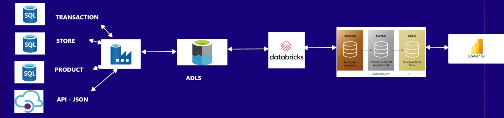

# End-to-End Azure Data Engineering Project  /Retail Project 
Azure Data Factory | Azure Databricks | Azure Data Lake | Power BI

## Project Overview
This project demonstrates a complete Azure-based data engineering pipeline that ingests raw retail data, processes it using Apache Spark in Azure Databricks, stores the processed data in Azure Data Lake Storage, and visualizes business insights using Power BI.

The objective of this project is to simulate a real-world enterprise data engineering workflow where raw data is processed through multiple layers (Bronze, Silver, and Gold) before being used for analytics and reporting.

---

## Architecture

Source Data  
   ↓  
Azure Data Factory  
   ↓  
Azure Data Lake Storage (Bronze Layer)  
   ↓  
Azure Databricks (Data Transformation)  
   ↓  
Azure Data Lake Storage (Silver and Gold Layer)  
   ↓  
Power BI Dashboard




---

## Technology Stack

| Technology | Purpose |
|-----------|--------|
| Azure Data Factory | Data ingestion and orchestration |
| Azure Data Lake Storage Gen2 | Storage for raw and processed data |
| Azure Databricks | Distributed data processing using Apache Spark |
| PySpark | Data transformation and processing |
| Azure Blob Storage | Source data storage |
| Power BI | Data visualization and analytics |

---

## Project Workflow

### 1. Data Ingestion
Raw retail datasets are ingested into Azure Data Lake Storage using Azure Data Factory pipelines.

Tasks performed:
- Extract data from the source
- Load raw data into the Bronze layer
- Schedule and orchestrate ingestion pipelines


---

### 2. Bronze Layer (Raw Data)
The Bronze layer stores raw data exactly as it is received from the source.

Characteristics:
- Stores unprocessed raw data
- Maintains data for auditing and historical tracking
- Serves as the base layer for further processing

Example datasets include:
- Customers
- Orders
- Products
- Sales transactions

---

### 3. Data Processing using Azure Databricks
Azure Databricks is used to perform data transformation using Apache Spark and PySpark.

Operations performed include:
- Data cleaning
- Handling missing values
- Filtering records
- Joining multiple datasets
- Aggregations and transformations


Example PySpark code:

```python
df_orders = spark.read.format("csv") \
.option("header", "true") \
.load("wasbs://retail@storageaccount.blob.core.windows.net/orders.csv")

df_orders_clean = df_orders.filter(df_orders.order_status == "COMPLETE")
```

---

### 4. Silver Layer (Cleaned Data)

The Silver layer contains cleaned and structured data that has been transformed from the raw Bronze layer.

Characteristics:

- Cleaned and validated data  
- Structured format suitable for analytics  
- Improved data quality and consistency  

This layer performs operations such as:

- Removing duplicates  
- Handling null values  
- Data type conversions  
- Data standardization  

---

### 5. Gold Layer (Business-Level Data)

The Gold layer contains aggregated and business-ready datasets prepared for reporting and analytics.

Examples of business-level datasets include:

- Sales by region  
- Monthly revenue  
- Top selling products  
- Customer insights  

Example transformation using PySpark:

```python
df_sales_summary = df_orders_clean.groupBy("region") \
.sum("sales_amount")
```


This layer is optimized for reporting and business intelligence tools.

## Data Visualization using Power BI

The final curated dataset stored in the Gold layer is connected to Power BI to create interactive dashboards.

Key insights generated from the dashboard:

- Total revenue

- Sales by region

- Top performing products

- Monthly sales trends

- Customer purchasing behavior

Power BI allows business users to analyze the processed data and make informed decisions.

---
## Key Learning Outcomes

This project demonstrates:

- Building end-to-end data pipelines on Azure

- Data ingestion using Azure Data Factory

- Data processing using Apache Spark in Databricks

- Data lake architecture with Bronze, Silver, and Gold layers

- Data visualization using Power BI

- Enterprise-level data engineering workflow
---
 

## Use Cases

This architecture is commonly used for:

- Retail analytics

- Sales performance analysis

- Customer behavior analysis

- Data warehousing pipelines

- Business intelligence reporting

